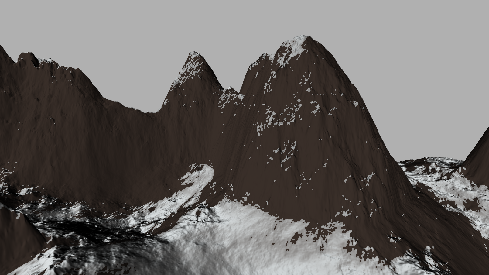

# Terrain Generator
by Garrett Gunnell

## Goals
* Generate interesting, unique height maps for use in other projects
* Utilize several different techniques for generating terrain
* Understand how to make use of the gradient of noise functions
* Experiment with different terrain shading techniques from toon to physically based
* Learn how skyboxes work

### Examples

Terrain:  

### Resources
https://iquilezles.org/www/index.htm  
https://www.decarpentier.nl/scape-procedural-extensions  
https://www.youtube.com/watch?v=C9RyEiEzMiU&ab_channel=GDC